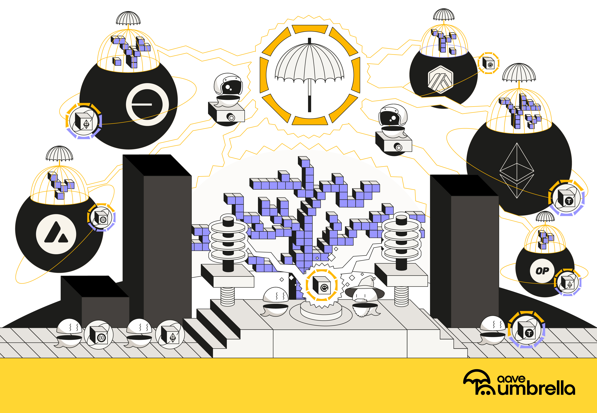

# Aave Umbrella



<br>

## Umbrella core overview

`Umbrella` is an upgraded version of the Aave Safety Module, based on a staking and slashing mechanism. The primary reserve coverage asset is an `aToken` wrapped in a [`waToken (StataTokenV2)`](https://github.com/bgd-labs/aave-v3-origin/blob/main/src/contracts/extensions/stata-token/README.md). However, assets not directly connected to the Aave ecosystem (such as various LP or staked/restaked tokens) may also be utilized. This system employs a series of contracts designed to semi-automatically address reserve deficits while providing additional rewards to `StakeToken` holders.

<br>

## Umbrella key components

The `Umbrella` system comprises three main components:

- [`Umbrella`](/src/contracts/umbrella/README.md): The central contract that orchestrates the system and serves as the entry point for addressing deficits through the slashing mechanism. It incorporates logic for estimating required funds to cover debt, managing system configurations, and creating new `StakeToken`s. The `Umbrella` contract is connected to each `Pool` across all networks to monitor reserve deficits and semi-automatically mitigate them when they occur.

- [`StakeToken`](/src/contracts/stakeToken/README.md): An upgraded version of the `Aave Stake Token`, responsible for holding reserve assets. These assets can be slashed to cover deficits. Each `StakeToken` maintains an exchange rate tied to its underlying assets, which adjusts based on slashing events. The `StakeToken` is integrated with the reward system via a hook and the `RewardsController` contract. Additionally, it includes logic for fund withdrawals through a cooldown mechanism. For each market protected by the `Umbrella` system, one or more `StakeToken`s will be created.

- [`RewardsController`](/src/contracts/rewards/README.md): A revised contract designed to allocate incentives to `StakeToken` holders. It facilitates the distribution of rewards and manages the claims process for these stakeholders. The contract supports the distribution of multiple types of rewards (up to eight in the current implementation) and operates as a single instance per network.

<br>

## Setup

```sh
cp .env.example .env
forge install
```

<br>

## Test

```sh
forge test
```

<br>

## License

Copyright © 2025, Aave DAO, represented by its governance smart contracts.

The [BUSL1.1](./LICENSE) license of this repository allows for any usage of the software, if respecting the Additional Use Grant limitations, forbidding any use case damaging anyhow the Aave DAO's interests.
Interfaces and other components required for integrations are explicitly MIT licensed.
