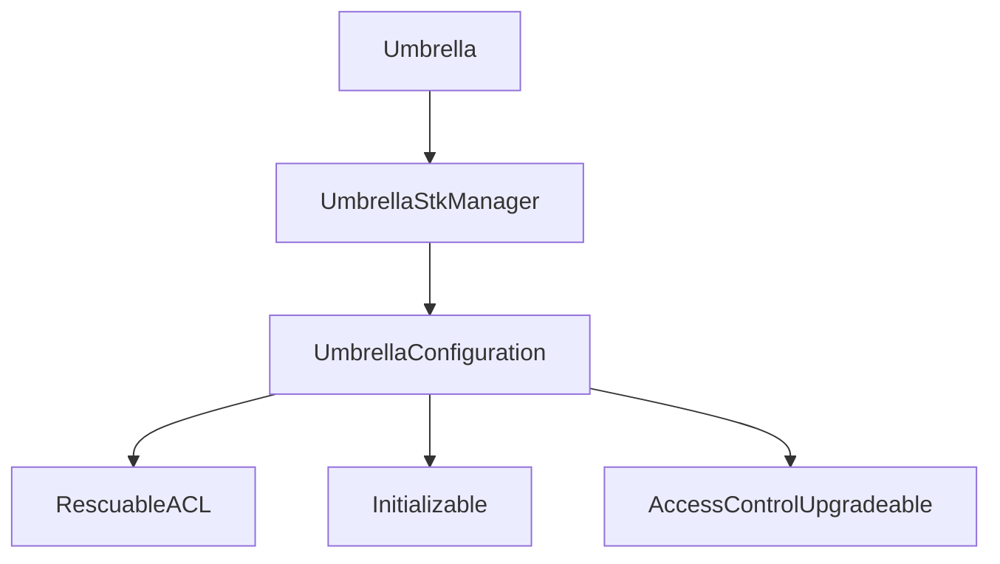

# Aave Umbrella

`Umbrella` is the core smart contract within the broader [Umbrella](https://governance.aave.com/t/bgd-aave-safety-module-umbrella/18366) project, enabling creation, configuration and slashing of `UmbrellaStakeToken`s, together with coverage of deficit in the associated Aave pool.

<br>

## Glossary

- **StakeToken (UmbrellaStakeToken)**. Tokens where stakers supply aToken (or GHO), with risk of slashing, but receiving rewards in exchange. E.g. `stkwaUSDC` representing staked waUSDC (wrapped aToken of USDC).
- **Underlying**. The asset staked on the StakeToken. E.g. `waUSDC` for the stkwaUSDC StakeToken.
- **Reserve**. The underlying borrowed asset on Aave, that Umbrella covers. E.g. `USDC`.
- **Deficit**. Bad debt accrued on the Aave pool connected to Umbrella.
- **Pending Deficit**. Variable representing funds that were slashed, but pending to be covered on the pool.
- **Deficit Offset**. Variable representing a lower threshold to not slash funds under it. E.g. (with some extra logic aside), high-level a 1'000 offset means that until the deficit accrued is below 1'000, no slashing will happen.
- **Slash**. The action of seizing underlying tokens from a StakeToken, depending on the deficit and other constraints of the system (e.g. offset).
- **Cover**. The action of using external aToken/GHO funds to cover the deficit on the Aave pool connected to Umbrella. Happens after slashing, but not atomically, and only by authorized parties.
- **Liquidation Fee**. Variable representing percent of funds, which should always be confiscated in excess of the "real" deficit amount. This commission for most configurations will be 0%, but in different situations it can be set to an arbitrary value up to 100%.

<br>

## Features

- **StakeToken factory and controller**. Creation and configuration of all `StakeToken`s happens via the Umbrella contract, to simplify operational flows and data gathering.
- **Slashing**. Functionality to slash `StakeToken`s whenever the deficit conditions in the Aave pool and the Umbrella internal accounting are met. Umbrella also allows for slightly more sophisticated slashing mechanisms like its own Liquidation Fee, allowing to add a margin on top of the value required to slash, to cover any additional cost.
- **Deficit coverage**. Functionality to cover deficit on the connected Aave pool by transferring aTokens from the caller (or non-aTokens for cases like GHO).
Apart from reading the `deficit` for a specific asset (reserve) on the Aave pool associated, Umbrella also keeps internal accounting for aspects like pending deficit to be covered after slash, or configurable slashing offset to consider and not slash until reaching it. Additionally, Umbrella is the contract keeping track of the `StakeToken`s covering each Aave reserve, with a 1:1 relation in this initial version: each Aave reserve has a single `StakeToken` associated.

<br>

## High-level technical overview

### Inheritance Structure

Umbrella consists of several key components organized in a hierarchical structure:

- **UmbrellaConfiguration**: Manages system configuration and storage, with the required access control.
- **UmbrellaStkManager**: Factory and controller of `StakeToken`s, allowing creating new ones and changing their configuration.
- **Umbrella**: Contract inheriting from the others, with functionality to slash `StakeToken`s and cover deficit.

<br>

The diagram below illustrates the inheritance and dependency relationships between the core contracts:



### Access Control

There are four roles used to manage `StakeToken`s, slash configurations, coverage, and other minor functions.

- `DEFAULT_ADMIN_ROLE` will be assigned to Aave governance and responsible for:
  - Updating and deleting slashing configurations.
  - Сreating new `StakeToken`s, as well as updating their `cooldown`s and `unstakeWindow`s.
  - Change the deficit offset.
- `COVERAGE_MANAGER_ROLE` to be assigned to the Aave governance, together with any extra smart contract doing management of deficit coverage. Able to cover reserve pending deficit or deficit offset.
- `RESCUE_GUARDIAN_ROLE` to be assigned to the Aave governance, together with one or multiple Aave guardians (multi-sig). It can rescue funds sent by mistake to Umbrella contracts, including `Umbrella` contract itself and all the `UmbrellaStakeToken`s deployed by this contract.
- `PAUSE_GUARDIAN_ROLE` to be assigned to the Aave governance, together with the Aave protocol Guardian (multi-sig). It can `pause/unpause` `StakeToken`s in case their operation must be stopped/resumed.

<br>

## Key Functions

### `slash`

- **Purpose:** Transfer underlying funds from the `StakeToken` to the `Collector`, to later on cover deficit.
- **Functionality:**
  - Automatically converts the needed amount of assets, using the exchange rate obtained directly from contracts/oracles.
  - Transfers the converted and slashed funds to the `Collector`'s address.
  - Increases `pendingDeficit` by the amount of assets withdrawn from `StakeToken` multiplied by its exchange rate.

### `coverPendingDeficit`

- **Purpose:** Covers a reserve pending deficit using funds provided by `msg.sender`.
- **Role:** `COVERAGE_MANAGER_ROLE` - only.
- **Functionality:**
  - Requires an `allowance` to be set up for the transfer of funds.
  - Supports covering reserves regardless of whether virtual accounting is enabled or disabled.
  - Acts exclusively over pending deficit, and not deficit offset.

### `coverDeficitOffset`

- **Purpose:** Covers a reserve deficit offset using funds provided by `msg.sender`.
- **Role:** `COVERAGE_MANAGER_ROLE` - only.
- **Functionality:**
  - Requires an `allowance` to be set up for the transfer of funds.
  - Supports covering reserves regardless of whether virtual accounting is enabled or disabled.
  - Acts exclusively over deficit offset, not affecting pending deficit.
  - To be very rarely used, mainly in scenarios where the DAO wants to cover certain deficit on the Aave pool without having slashed stakers.

### `coverReserveDeficit`

- **Purpose:** Covers a reserve deficit using funds provided by `msg.sender`.
- **Role:** `COVERAGE_MANAGER_ROLE` - only.
- **Functionality:**
  - Requires an `allowance` to be set up for the transfer of funds.
  - Supports covering reserves regardless of whether virtual accounting is enabled or disabled.
  - Only used to cover deficit if reserve has not been configured within `Umbrella` and there is no information left about the past `pendingDeficit/deficitOffset`.
  - To be very rarely used, mainly in scenarios where the DAO wants to cover certain deficit on the Aave pool without the reserve setup procedure inside `Umbrella` (no current/previous deficit, no `SlashingConfig`s).

### `setDeficitOffset`

- **Purpose:** Sets a new value of offset deficit for a reserve.
- **Role:** `DEFAULT_ADMIN_ROLE` - only.
- **Functionality:**
  - Even if permissioned, doing basic validations for consistency of deficit, pending deficit, and offset.


### `updateSlashingConfigs`

- **Purpose:** Add or update slashing configurations.
- **Role:** `DEFAULT_ADMIN_ROLE` - only.
- **Functionality:**
  - Sets a deficit offset if the configuration was previously empty.
  - Installs or updates an oracle to estimate the value of the underlying token and configures the `LiquidationFee`.
  - Adds a `StakeToken` to the slashing configuration.

### `removeSlashingConfigs`

- **Purpose:** Remove slashing configurations.
- **Role:** `DEFAULT_ADMIN_ROLE` - only.
- **Functionality:**
  - Removes a `StakeToken` as a source for deficit coverage, along with its associated configuration and oracle.
  - Does not modify the pending and offset deficits.
- **Additional notes:**
  - There is currently no preparation for removing a `StakeToken` from the configuration. Withdrawn funds can still be used to cover the deficit.
  - In addition to changes in the slash configuration structure, the removal of a `StakeToken` may also occur to replace it with a new one.
    - A typical scenario might involve repeated shortages requiring a `slash` of a relatively large amount of funds (e.g., >50% of `totalAssets`).
    - In such cases, the `totalSupply/totalAssets` ratio can significantly increase, leading to the need for a replacement `StakeToken` to ensure the correct operation of the system.
    - If the entire deficit was covered during the operation of the old `StakeToken`, then the order in which the `removeSlashingConfig()` and `updateSlashingConfig()` functions are called is not important.
    - If there is a deficit in the system that cannot be covered by the old `StakeToken`, or a new deficit appears during the replacement process, then `DEFAULT_ADMIN_ROLE` should first call `removeSlashingConfig()` and then `updateSlashingConfig()`. For simplicity, it is suggested to always delete the configuration first and then add a new one.

### `createStakeTokens`

- **Purpose:** Create new `StakeToken`s.
- **Role:** `DEFAULT_ADMIN_ROLE` - only.
- **Functionality:**
  - Creates a new `StakeToken` using a proxy, an implementation contract, and the address of the underlying asset.
  - Assigns `Umbrella` as the owner of the new `StakeToken`.
  - Configures the specified `cooldown`, `unstakeWindow`, and appends a `suffix` at the end of the token's `name` and `symbol`.

<br>

*Additionally, Umbrella has some extra "minor" functions to set StakeToken parameters, or pause/unpause*

<br>

## Explaining the Deficit Elimination Process

A realistic example of full flow slash + coverage is as follows:

1. The function `slash(USDC)` is called, where `USDC` represents the address of the `USDC` reserve. Within this function, the following steps take place:
    1. The `isReserveSlashable(USDC)` check is performed. This returns a flag indicating whether slashing is possible and the amount of the new deficit.
        1. The current value of the pool deficit for the reserve is calculated.
        2. The presence of a new deficit is identified by comparing the current deficit with the previously established value.
        3. If a new deficit exists and the number of configurations for the reserve is equal to 1, the function confirms that a slash can be performed. Otherwise slashing is not possible.
    2. If slashing is not possible, the function terminates.
    3. The number of configurations and the parameters set for this reserve are determined. Should be 1 in the current version.
    4. The internal function `_slashAsset()` is called. Inside this function:
        1. The deficit is recalculated, taking into account the `liquidationFee` (for most assets, the bonus will be 0%).
        2. The deficit amount is multiplied by the price of the reserve (the price is obtained from Aave's standard oracle).
        3. The price of the underlying asset to be slashed for coverage is set.
        4. The quantity of the asset to be slashed is determined.
        5. The actual slash of the asset is performed, and the real amount successfully seized is returned. (This may differ from the requested amount if, for example, the `UmbrellaStakeToken` does not have enough balance locked, considering also `liquidationFee` commission). The assets are transferred to the specified `SLASHED_FUNDS_RECIPIENT` address (e.g., the Aave collector).
        6. A recalculation determines the actual amount of the deficit that has been covered as a result.
    5. Using the obtained result, the new value of `pendingDeficit` is set.
    6. The result is returned.

2. Post-slash, the system in high-level "hedged", as a trusted entity (e.g. Aave Collector), holds the aTokens to be burnt. During this time before cover, more slashing could happen, not creating any type of issue.
 Operationally, if not using a different setup handling that in advance, the entity holding the slashed aTokens will need to prepare them for cover, for example by unwrapping them and giving allowance to Umbrella.

3. The function `coverPendingDeficit(USDC, amount)` is called, where the amount corresponds to the number of tokens we are ready to provide for deficit elimination.
    1. First, it is determined whether there is a deficit that we are attempting to cover.
    2. It is determined whether virtual accounting is enabled (detecting if GHO or not).
    3. Based on the status of virtual accounting, the transfer is performed using either `aToken` or the `reserve` itself.
    4. The actual elimination of the deficit is carried out.
    5. The pending deficit accounting is updated, discounting from it the covered amount.

<br>

## Precision in Price Conversion

In the current version, all assets should consist exclusively of similar types. As a result, the only source of error in price recalculation arises from the `exchangeRate` precision during the price estimation of the underlying `StakeToken`, since the initial price is the same for all assets.

For example:

- `stkwaUSDC` - `StakeToken` (if the suffix passed to `createStakeTokens` is empty)
- `waUSDC` - `wrapped aToken` (also the underlying asset of the `StakeToken`)
- `aUSDC` - `aToken`
- `USDC` -  `reserve`

The price of the wrapped aToken is calculated as:

```solidity
 priceOfWaToken = priceOfReserve * rate() / ray;
```

Given current values, the error in this calculation should not exceed 1 wei. This means the precision loss is dependent solely on the magnitude of the index.

<br>

## Limitations

- In the current version, the ability to cover the reserve using a basket of assets is disabled. However, internal storage is designed in such a way that future updates to enable the ability to cover deficit with basket should not change its structure.
- If one `StakeToken` is replaced by another similar one (for technical reasons), governance must firstly delete the old one from slashing config (using `removeSlashingConfigs`) and then add new (using `updateSlashingConfigs`) in order to reinstall the deficit offset (to avoid instant slash of new users).
 Still, this is a very ad-hoc action that should have a human-review component involved, and not expect the code to handle all edge scenarios flawlessly.
- The underlying asset of the `StakeToken` must always have the same number of decimals as the corresponding `aToken` or `reserve`. Consequently, we assume that different `LP` tokens or tokens of other assets (e.g., ETH to cover BTC) cannot be used in the current version.
- Inheriting the assumption from Aave itself, the Umbrella system assumes non-"weird" behaviour on the tokens being added as underlying of StakeToken/s, and Aave reserves covered. Including but non-limited to ERC-777, tokens with active fee on transfer, etc.
 In any case, instantiation/activation of new StakeToken/s on Umbrella involves a governance procedure with human/tooling review included.
- Umbrella's design assumes that whenever an existing Aave reserve is initialized with a StakeToken, the existing deficit on the pool will not immediately cause a slash. In addition, it is always recommended just after initialization to add a certain deficit offset (via `setDeficitOffset()`) on top of the current pool's deficit, to avoid early slashings (even if very minor) due to dust deficit.

<br>

## Misc system's properties and assumptions

- Pending deficit should be less or equal to the pool deficit.
- Pending deficit only gets increased via `slash()`.
- On the first initialization of a reserve, `deficitOffset` will be set to the current pool's reserve deficit. If a higher value is required, it should be done ad-hoc just after by using `setDeficitOffset()`.
- If all slashing configurations are removed for a reserve, `pendingDeficit` and `deficitOffset` stay and can be covered in the future. This should be taken into account and is not recommended. Better to first cover all outstanding deficits, and then remove the reserve.
- If the slashing configuration is re-initialized after its removal, then `deficitOffset` will be set to `deficit - pendingDeficit`.
